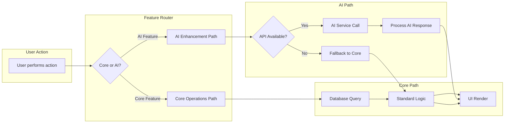
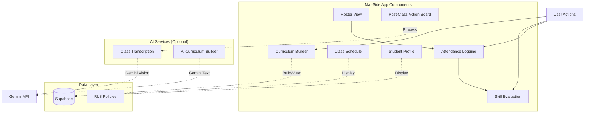
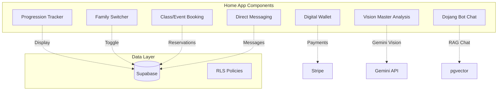

# KoryoGraph Development Roadmap & Architecture Plan

## Executive Summary

This document outlines the strategic development plan for **KoryoGraph**, a modular SaaS platform designed to compete directly with Spark software for martial arts studios. The architecture follows a **monorepo** structure with four Next.js applications sharing a unified Supabase PostgreSQL database.

---

## Current State Assessment

### ✅ Completed Foundation
- **Monorepo Structure**: Turborepo with 4 apps (`app`, `desk`, `home`, `login`) and 3 shared packages (`ui`, `database`, `eslint-config`, `typescript-config`)
- **Database Schema**: Complete Supabase schema across 4 SQL files covering:
  - Multi-tenancy (tenants, locations)
  - Identity & RBAC (profiles, roles, user_roles)
  - Multi-track progression engine (programs, curriculum_ranks, skills_checklist, student_progression)
  - Mat-side execution (classes, attendance_logs, skill_evaluations, class_transcripts)
  - Billing & e-commerce (subscriptions, invoices, products, product_variants, pos_transactions)
  - Events & camps (events_and_camps, event_registrations)
  - Waivers & direct messaging
  - Row Level Security (RLS) policies with tenant-aware access control
- **UI Components**: Shared component library with button, card, app-switcher, theme-provider

### ⚠️ Current Implementation Status
All apps currently contain **boilerplate/mock data** implementations. No production database integration exists yet. The foundation is solid; implementation begins now.

---

## Development Strategy: Core vs. AI Features

### Design Principle: **"AI-Optional, Core-Mandatory"**

Every feature in the PRD is categorized as either:
1. **Core Operations** - Must function without AI (manual data entry, standard workflows)
2. **AI-Native Enhancements** - Optional AI-powered features that enhance but don't replace core functionality

### Implementation Pattern for AI Features

```typescript
// Example pattern for AI feature integration
interface FeatureConfig {
  aiEnabled: boolean;
  fallbackBehavior: () => void; // Manual alternative when AI is disabled
}

function ClassTranscriptionService(config: FeatureConfig) {
  if (config.aiEnabled && process.env.GEMINI_API_KEY) {
    return useAIWorkflow('transcribe-class', config);
  } else {
    return config.fallbackBehavior(); // Manual attendance logging UI
  }
}
```

This ensures:
- **Graceful degradation** when AI endpoints are unavailable
- **No breaking changes** to existing workflows
- **Clear separation** between core and enhancement code paths

---

## Database Schema Completeness Check

The current schema covers all major entities from the PRD. Missing pieces that need attention:

| Entity | Status | Notes |
|--------|--------|-------|
| `tenants` | ✅ Complete | Multi-tenancy foundation |
| `locations` | ✅ Complete | Branch management |
| `profiles` | ✅ Complete | User identity with tenant linking |
| `roles` / `user_roles` | ✅ Complete | RBAC foundation |
| `families` / `family_members` | ✅ Complete | Parent-child billing structure |
| `programs` | ✅ Complete | Multi-discipline support |
| `curriculum_ranks` | ✅ Complete | Belt/grade progression |
| `skills_checklist` | ✅ Complete | Granular competency tracking |
| `student_progression` | ✅ Complete | Junction table for multi-track |
| `classes` | ✅ Complete | Schedule management |
| `attendance_logs` | ✅ Complete | With source tracking (manual/ai/kiosk) |
| `skill_evaluations` | ✅ Complete | With accuracy_score & actionable_tip |
| `class_transcripts` | ✅ Complete | AI processing pipeline ready |
| `belt_testing_events` | ✅ Complete | Testing logistics |
| `belt_test_registrations` | ✅ Complete | Kukkiwon integration ready |
| `subscriptions` | ✅ Complete | Stripe integration |
| `invoices` | ✅ Complete | Billing ledger |
| `products` / `product_variants` | ✅ Complete | Inventory management |
| `pos_transactions` | ✅ Complete | Stripe Terminal integration |
| `leads` | ✅ Complete | CRM foundation |
| `communications_log` | ✅ Complete | Marketing automation |
| `events_and_camps` | ✅ Complete | Event management |
| `event_registrations` | ✅ Complete | With check-in/out tracking |
| `waivers` / `waiver_signatures` | ✅ Complete | Legal compliance |
| `messages` | ✅ Complete | Direct messaging |

**RLS Policies**: Partially implemented. Need tenant-aware policies for all tables.

---

## Development Phases

### PHASE 1: Foundation & Architecture (Weeks 1-2)

#### Goals
- Establish development environment templates
- Create shared type definitions
- Set up AI feature abstraction layer
- Configure environment variables per app

#### Tasks

**1.1 Environment Variable Templates**
Create `.env.example` files for each app with:
- Core: `NEXT_PUBLIC_SUPABASE_URL`, `NEXT_PUBLIC_SUPABASE_ANON_KEY`
- Desk-specific: Stripe keys, inventory settings
- App-specific: Class transcription settings
- Home-specific: Vision API settings

**1.2 Shared Type Definitions**
Create `packages/types/shared.ts` with interfaces used across apps:
```typescript
// Example shared types
export interface StudentProfile {
  id: string;
  firstName: string;
  lastName: string;
  rankId?: string;
  beltColor?: string;
}

export interface ClassSchedule {
  id: string;
  name: string;
  dayOfWeek: string[];
  startTime: string;
  endTime: string;
}

export interface AttendanceRecord {
  studentId: string;
  checkedInAt: Date;
  source: 'manual' | 'ai_transcript' | 'kiosk';
  notes?: string;
}
```

**1.3 AI Feature Abstraction Layer**
Create `packages/ai-core/src/` with:
- Base interface for all AI services
- Fallback behavior patterns
- Configuration schema for enabling/disabling features

#### Deliverables
- `.env.example` files for all 4 apps
- `packages/types/shared.ts` with core interfaces
- `packages/ai-core/` directory structure
- Updated README documenting environment setup

---

### PHASE 2: KoryoGraph Desk (Spark Feature Parity) - Weeks 3-8

#### Priority: **HIGHEST** - Direct competition to Spark

#### Core Operations Implementation (Weeks 3-5)

| Feature | Components | Database Tables |
|---------|------------|-----------------|
| **Student CRM & Family Linking** | Student list view, family dropdown, profile modal | `profiles`, `families`, `family_members` |
| **Billing & POS** | Invoice list, payment processing, Stripe Terminal integration | `subscriptions`, `invoices`, `pos_transactions` |
| **Inventory Management** | Product catalog, stock levels, low-stock alerts | `products`, `product_variants` |
| **Event & Camp Management** | Event calendar, registration forms, billing cycles | `events_and_camps`, `event_registrations` |
| **Belt Testing Logistics** | Eligible student list, fee collection, certificate generation | `belt_testing_events`, `belt_test_registrations` |
| **Staff & Role Management** | User invite, role assignment, permission matrix | `profiles`, `user_roles`, `roles` |
| **Marketing CRM** | Lead pipeline board, campaign builder, SMS/Email broadcast | `leads`, `communications_log` |

#### AI-Native Enhancements (Weeks 6-8)

| Feature | Components | API Integration |
|---------|------------|-----------------|
| **Magic Inventory Receiver** | Image upload, SKU extraction UI, draft stock update | Gemini Vision API |
| **Generative AI Dashboards** | Natural language query input, chart rendering | Gemini Text API + Chart.js/Recharts |
| **Desk AI Assistant** | Chat interface, RAG context from studio docs | Supabase pgvector + Gemini |
| **Drift Detector** | Nightly CRON job, churn risk scoring, draft SMS UI | Scheduled function + Communications_log |
| **Empathetic Billing Recovery** | Failed payment webhook handler, tone-adjusted SMS | Stripe webhooks + Gemini |
| **Frictionless Sales** | Auto-generated SMS URLs for trials/gear | Twilio/SendGrid integration |

#### Implementation Order
1. **Week 3-4**: Student CRM + Family Linking (foundational)
2. **Week 4-5**: Billing & POS (revenue-critical)
3. **Week 5**: Inventory Management
4. **Week 6**: Event & Camp Management
5. **Week 6**: Belt Testing Logistics
6. **Week 7**: Staff & Role Management + RLS policies
7. **Week 7-8**: AI enhancements (all optional, parallel development)

#### Deliverables
- Functional Desk app with all core features
- Stripe Terminal integration for POS
- Inventory tracking with low-stock alerts
- Belt testing event management
- Marketing CRM pipeline view
- AI feature flags for graceful degradation

---

### PHASE 3: KoryoGraph Mat-Side App (Competitive Differentiator) - Weeks 9-14

#### Priority: **HIGH** - Key differentiator vs. Spark

#### Core Operations Implementation (Weeks 9-11)

| Feature | Components | Database Tables |
|---------|------------|-----------------|
| **Manual Roster & Attendance** | Tablet-optimized roster view, tap-to-check-in | `classes`, `attendance_logs` |
| **Skill & Belt Logging** | Student selection, skill checklist, belt promotion | `student_progression`, `skill_evaluations` |
| **Class Schedule View** | Daily/weekly calendar, instructor assignments | `classes` |
| **Student Quick-Profile** | Emergency contacts, injuries, progression history | `profiles`, `student_progression` |
| **Choreography Timeline Tool** | Formation notes, audio file sync | `classes` (extended) |
| **Curriculum Builder & Viewer** | Lesson plan editor, daily plan display | `curriculum_ranks`, `skills_checklist` |

#### AI-Native Enhancements (Weeks 12-14)

| Feature | Components | API Integration |
|---------|------------|-----------------|
| **Continuous Class Transcription** | Recording UI, post-class action board, approve-all | Gemini Vision + NER |
| **AI Curriculum Builder** | Prompt-based lesson generation | Gemini Text API |

#### Implementation Order
1. **Week 9-10**: Manual Roster & Attendance (primary mat-side workflow)
2. **Week 10-11**: Skill & Belt Logging + Student Quick-Profile
3. **Week 11**: Class Schedule View + Curriculum Builder
4. **Week 12**: Choreography Timeline Tool
5. **Week 12-14**: AI enhancements (transcription + curriculum builder)

#### Deliverables
- Tablet-optimized attendance workflow
- Skill evaluation interface
- Progression tracking UI
- Post-class action board with AI transcription
- Curriculum builder/editor

---

### PHASE 4: KoryoGraph Home App (Member Experience) - Weeks 15-20

#### Priority: **MEDIUM** - Member-facing, builds loyalty

#### Core Operations Implementation (Weeks 15-17)

| Feature | Components | Database Tables |
|---------|------------|-----------------|
| **Visual Progression Tracker** | Current rank, stripes, progress bar | `student_progression`, `curriculum_ranks` |
| **Digital Wallet & Payments** | Payment method update, invoice payment, billing history | `subscriptions`, `invoices` |
| **Family Switcher UI** | Dropdown to toggle between children | `families`, `family_members` |
| **Class Booking & Event RSVP** | Class calendar, private lesson booking, camp registration | `classes`, `events_and_camps`, `event_registrations` |
| **Direct Messaging** | Inbox, compose, message list | `messages` |

#### AI-Native Enhancements (Weeks 18-20)

| Feature | Components | API Integration |
|---------|------------|-----------------|
| **Vision Master** | Video upload, biomechanical analysis, accuracy score | Gemini Vision API |
| **Home AI Assistant (Dojang Bot)** | Q&A chatbot, RAG from studio docs | Supabase pgvector + Gemini |
| **Curriculum Translator** | Technical to parent-speak translation | Gemini Text API |

#### Implementation Order
1. **Week 15-16**: Visual Progression Tracker + Family Switcher
2. **Week 16-17**: Digital Wallet & Payments
3. **Week 17**: Class Booking & Event RSVP
4. **Week 18**: Direct Messaging
5. **Week 18-20**: AI enhancements (Vision Master, Dojang Bot, Curriculum Translator)

#### Deliverables
- Progression dashboard with visual indicators
- Payment portal for parents
- Family member switcher
- Class/event booking interface
- Secure messaging system
- Vision analysis tool (AI-powered)

---

### PHASE 5: Integration & Polish (Weeks 21-24)

#### Goals
- Unified identity across all apps
- App Switcher UI implementation
- RLS policy completion
- End-to-end testing
- Performance optimization

#### Tasks

**21-22: Unified Identity (SSO)**
- Implement Supabase Auth session sharing
- Create tenant-aware user linking
- Test cross-app authentication flows

**23: App Switcher UI**
- Build global navigation menu
- Implement app context switching
- Add branding per app (Desk/Mat/Home)

**24: RLS Policy Completion**
- Write tenant-aware policies for all tables
- Test role-based access control
- Document permission matrix

**25-26: End-to-End Testing**
- Core workflow testing (attendance, billing, progression)
- AI feature fallback testing
- Cross-app authentication testing
- Mobile/tablet responsiveness testing

**27-28: Performance Optimization**
- Database query optimization
- Image/video caching strategy
- Lighthouse performance audits
- Bundle size optimization

#### Deliverables
- Fully integrated multi-app experience
- Complete RLS policy coverage
- Comprehensive test suite
- Performance benchmarks

---

### PHASE 6: MVP Launch Preparation (Weeks 25-28)

#### Goals
- Documentation completion
- Beta testing
- Deployment pipeline setup
- Success metrics tracking

#### Tasks

**25: Documentation**
- User guides (Desk, Mat-Side, Home)
- Admin documentation
- API documentation (if external integrations)
- Onboarding videos/screenshots

**26: Beta Testing**
- Recruit 3-5 partner studios
- Deploy to staging Supabase instance
- Collect feedback on core workflows
- Iterate on AI feature tuning

**27: Deployment Pipeline**
- Vercel project setup for each app
- Environment variable management
- CI/CD pipeline with Turborepo
- Database migration strategy

**28: Success Metrics Setup**
- Analytics instrumentation (Vercel Analytics)
- KPI dashboards (churn, retention, mat-side friction reduction)
- A/B testing framework for AI features

#### Deliverables
- Complete documentation suite
- Beta test reports with iteration plan
- Production deployment ready
- KPI tracking dashboard

---

## Architecture Diagrams

### Monorepo Structure

```mermaid
graph TB
    subgraph "Root"
        apps[Apps Directory]
        packages[Packages Directory]
        supabase[Supabase Schema]
    end
    
    subgraph "apps/"
        app[KoryoGraph - Mat-Side]
        desk[KoryoGraph Desk - Admin]
        home[KoryoGraph Home - Member]
        login[Authentication]
    end
    
    subgraph "packages/"
        ui[UI Components]
        database[Database Client]
        ai-core[AI Core - Shared Logic]
        types[Shared Types]
    end
    
    app -.->|@repo/ui| ui
    desk -.->|@repo/ui| ui
    home -.->|@repo/ui| ui
    login -.->|@repo/ui| ui
    
    app -.->|@repo/database| database
    desk -.->|@repo/database| database
    home -.->|@repo/database| database
    
    ai-core -.->|Gemini API| gemini[Gemini APIs]
    ai-core -.->|pgvector| supabase_pgvector[Supabase pgvector]
```

### Feature Flow: Core vs. AI



### Desk App Architecture

```mermaid
flowchart TB
    subgraph "Desk App Components"
        Sidebar[Sidebar Navigation]
        DashboardShell[Dashboard Shell]
        Views[Feature Views]
    end
    
    subgraph "Views"
        CRM[Student CRM]
        Billing[Billing & POS]
        Inventory[Inventory Management]
        Events[Event Management]
        BeltTest[Belt Testing]
        Staff[Staff Management]
        Marketing[Marketing CRM]
        Analytics[Analytics Dashboard]
        AIAssist[AI Assistant Chat]
    end
    
    Sidebar --> DashboardShell
    DashboardShell --> Views
    
    subgraph "Data Layer"
        Supabase[(Supabase)]
        RLS[RLS Policies]
    end
    
    Views -.->|Queries| Supabase
    Supabase -.->|Enforced by| RLS
    
    subgraph "AI Services (Optional)"
        MagicInventory[Magic Inventory Receiver]
        GenDashboards[Generative Dashboards]
        DeskCopilot[Desk AI Assistant]
        DriftDetector[Drift Detector]
        BillingRecovery[Billing Recovery]
    end
    
    Views -.->|Gemini API| AI Services
```

### Mat-Side App Architecture



### Home App Architecture



---

## Risk Mitigation Strategy

### Risk: AI Feature Dependencies
**Mitigation**: All AI features have fallback behaviors. Core functionality works without AI.

### Risk: Database Schema Complexity
**Mitigation**: 
- Use `IF NOT EXISTS` for all schema changes
- Document migration strategy
- Test RLS policies thoroughly before production

### Risk: Multi-Tenant Data Isolation
**Mitigation**:
- All tables have `tenant_id` FK
- RLS policies enforce tenant isolation
- Tenant-aware queries in all database clients

### Risk: Stripe Integration Complexity
**Mitigation**:
- Use Stripe CLI for local testing
- Implement webhook retry logic
- Separate test/live environments

---

## Success Metrics (KPIs)

| Metric | Target | Measurement |
|--------|--------|-------------|
| Mat-Side Friction Reduction | 80% reduction in post-class data entry time | Time tracking before/after AI transcription |
| Data Accuracy | Zero visit attribution errors | Audit logs vs. actual attendance |
| Owner Adoption | 100% transition from legacy software within 30 days | User analytics, feature adoption rates |
| Desk Feature Parity | 100% of Spark features matched | Feature checklist comparison |
| AI Feature Adoption | >60% of users enable at least one AI feature | Feature flag analytics |
| Churn Reduction | 25% reduction in student churn (via Drift Detector) | Cohort analysis |

---

## Next Steps

1. **Review this plan** with the team
2. **Approve Phase 1 tasks** for immediate execution
3. **Set up development environment** for each app
4. **Create initial todo list** in Code mode for implementation

Would you like me to proceed with implementing Phase 1, or would you like to adjust any aspects of this plan first?
